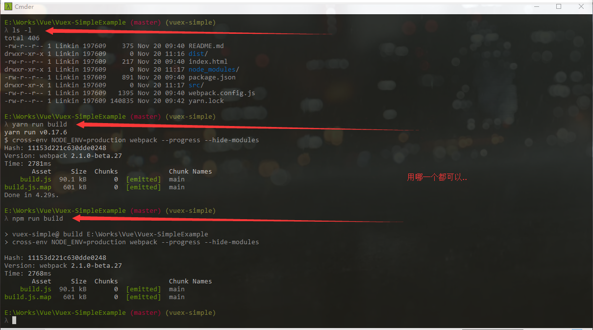
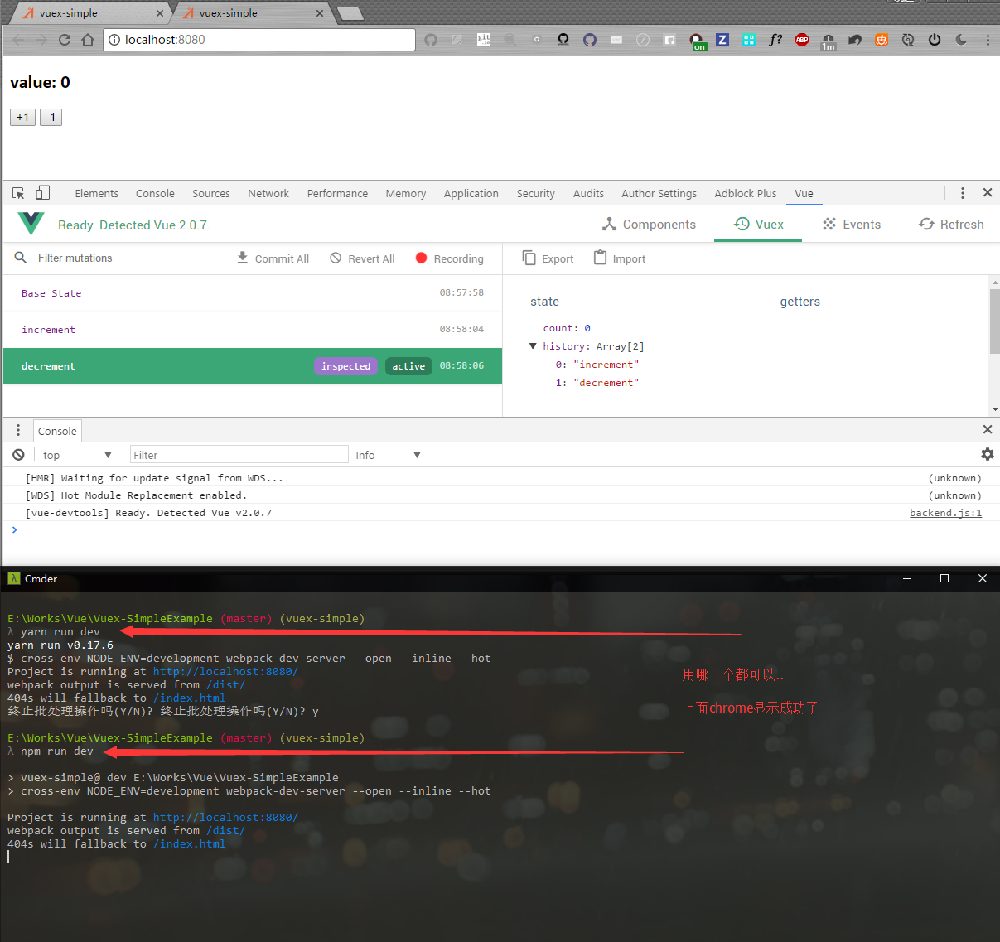

# vuex-simple Example

> vuex-simple Example:Vue components + Vuex,Counter App;
> 
> 一个最简单的Vuex示例: 组件与Vuex 管理状态, 一个计数器例子

:smirk: Haha

## Build Setup

``` bash
# install dependencies
npm install

# serve with hot reload at localhost:8080
npm run dev

# build for production with minification
npm run build
```

## 开发环境( 全局 ):
| 技术名称                                                      | 作用                      |  版本  |
| --------                                                      | -----:                   | :----:  |
| [Vuejs](http://cn.vuejs.org/)                                 | 框架                     |   2.8.1   |
| Webpack                                                       | 模块打包                  |  1.13.3  |
| Yarn                                                          | 模块依赖安装              |  0.17.6  |
| Node                                                          | Node.js                   |  6.9.1  |
| NPM                                                          | Node包管理               |  3.10.8  |

## 运行测试

### `build` - build for production with minification



***

### `dev` - serve with hot reload at localhost:8080



